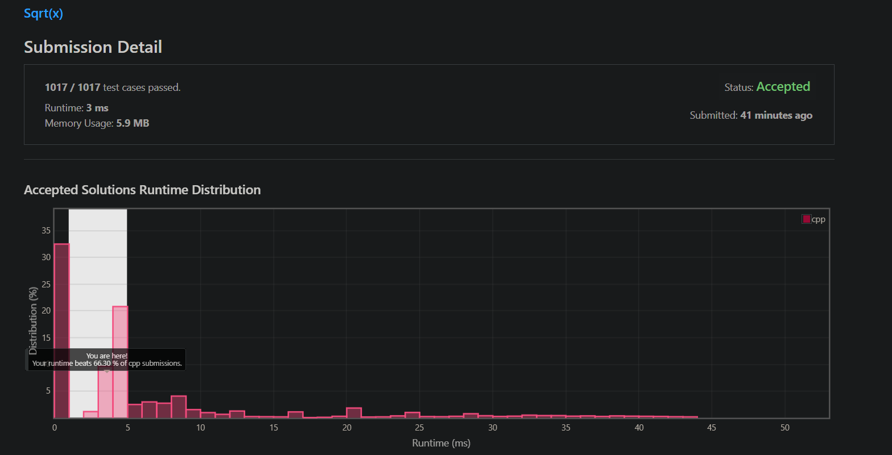

# Algo Course HW1

## 1. 本週影片中提到的NP-complete問題有哪些？

背包問題、旅行商人、二等分堆(背包問題變形)、藝廊監視器問題。


## 2. 請上網找一個老師沒說過的NP-complete問題，並舉個例子說明該問題的輸入與輸出。

#### Description:

> 已知漢米爾頓路徑為通過一圖的所有點，並且每個點只經過一次的迴路。

#### Input:
給定一張無向無權圖 g。

#### Output:
若存在漢米爾頓路徑，輸出 yes，否則 no。

## 3. 二元搜尋應用：當數字可以重覆

> 花費時間: 10分鐘，完成程度: 完全靠自己


### Sol-1. 線搜(N)

```c++
#include <bits/stdc++.h>
#define endl "\n"
using namespace std;

int solveLowerBound(vector<int> arr, int target) {

    int i = 0;
    while(i < arr.size()) {
        if(arr[i] == target) {
            return i;
        } else if(arr[i] > target) {
            return -1;
        }
        i++;
    }

    return -1;

}

int main() {
    vector<int> arr = {0, 0, 1, 1, 2, 2, 3, 5};
    cout << solveLowerBound(arr, 1) << endl;
    cout << solveLowerBound(arr, 4) << endl;
    cout << solveLowerBound(arr, 100) << endl;
    system("pause");
    return 0;
}
```

### Sol-2. 二分搜(logN)
```c++
#include <bits/stdc++.h>
#define endl "\n"
using namespace std;

int solveLowerBound(vector<int> arr, int target) {

    if(arr.size() == 0) {
        return -1;
    }

    int r = arr.size();
    int l = 0;

    while(l < r) {
        int mid = l + (r - l) / 2; // 避免 (r+l)/2 溢位
        if(arr[mid] >= target) {
            r = mid;
        } else {
            l = mid + 1;
        }
    }
    if(l >= arr.size() || arr[l] != target) {
        return -1;
    }
    return l;

}

int main() {
    vector<int> arr = {0, 0, 1, 1, 2, 2, 3, 5};
    cout << solveLowerBound(arr, 1) << endl;
    cout << solveLowerBound(arr, 4) << endl;
    cout << solveLowerBound(arr, 100) << endl;
    system("pause");
    return 0;
}
```

### Sol-3 c++ lower_bound function(logN)
```c++
#include <bits/stdc++.h>
#define endl "\n"
using namespace std;

int solveLowerBound(vector<int> arr, int target) {
    auto it = lower_bound(arr.begin(), arr.end(), target);
    return it == arr.end() || *it != target ? -1 : it - arr.begin();
}

int main() {
    vector<int> arr = {0, 0, 1, 1, 2, 2, 3, 5};
    cout << solveLowerBound(arr, 1) << endl;
    cout << solveLowerBound(arr, 4) << endl;
    cout << solveLowerBound(arr, 100) << endl;
    system("pause");
    return 0;
}
```


## 4. 二元搜尋應用：找數字該插入的位置

> 花費時間: 5分鐘，完成程度: 完全靠自己

[35. Search Insert Position - LeetCode](https://leetcode.com/problems/search-insert-position/)


用 lower_bound 找出答案。

```c++
class Solution {
public:
    int searchInsert(vector<int>& nums, int target) {
        return lower_bound(nums.begin(), nums.end(), target) - nums.begin();
    }
};
```


## 5. 二元搜尋應用：找到最早出問題的版本

> 花費時間: 5分鐘，完成程度: 完全靠自己

[278. First Bad Version](https://leetcode.com/problems/first-bad-version)


一樣是 lower_bound 題目。

```c++
// The API isBadVersion is defined for you.
// bool isBadVersion(int version);

class Solution {
public:
    int firstBadVersion(int n) {
        int l = 0;
        int r = n-1;
        
        while(l < r) {
            int mid = l + (r-l) / 2;
            if(isBadVersion(mid+1)) {
                r = mid;
            } else {
                l = mid + 1;
            }
        }
        
        return l + 1;
        
    }
};
```


## 6. 二元搜尋應用：開根號後的整數部分

> 花費時間: 10分鐘，完成程度: 完全靠自己


```c++
#include <bits/stdc++.h>
#define endl "\n"
using namespace std;

int solve(int n) {

    // I prefer just return floor(sqrt(n));
    if(n == 1 || n == 0) {
        return n;
    }
    int l = 0;
    int r = n-1;
    
    while(l < r) {
        long long mid = l + (r-l) / 2;
        if((mid+1) * (mid+1) > n) {
            r = mid;
        } else {
            l = mid + 1;
        }
    }
    
    return l;
}

int main() {
    cout << solve(23598) << endl;
    system("pause");
    return 0;
}
```

## 7. 本週心得

這節簡單認識了演算法的題目有哪些，並且對於二分搜有些實作(尤其是 lower_bound)，適應程度: OK，目前還未超出自己的能力範圍，喜惡程度: 不錯，總算有時間好好想 lower_bound 如何實作。
