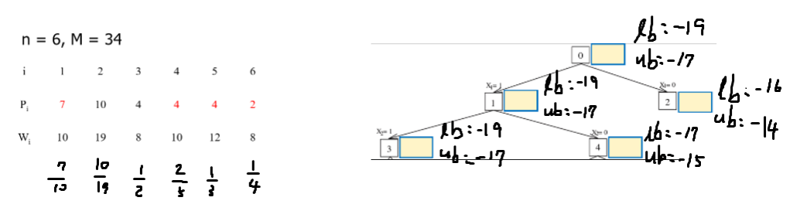
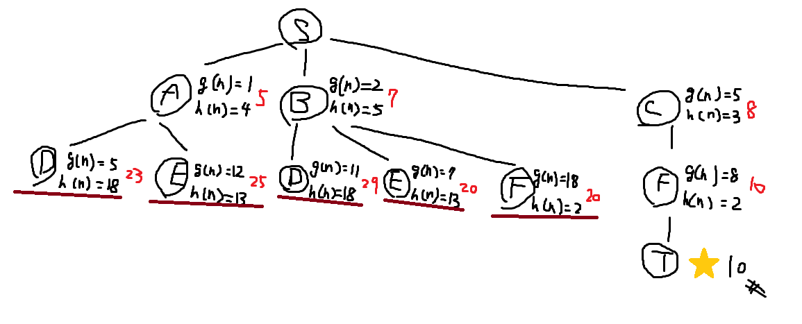
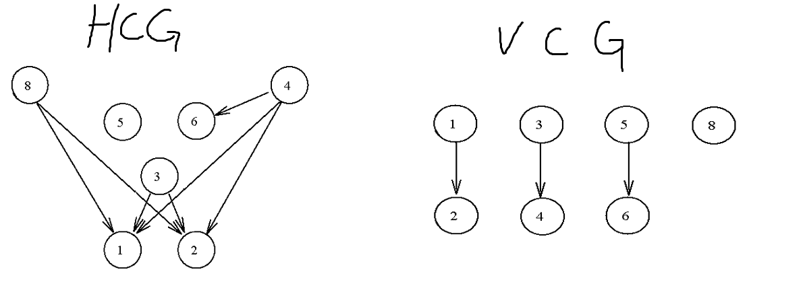
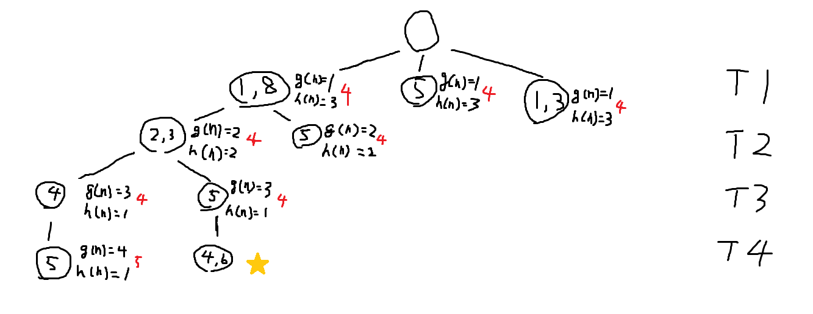
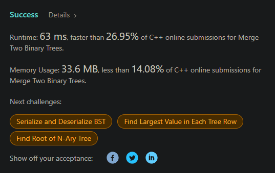
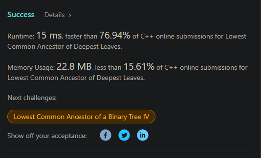

# 演算法作業 HW10

## 第1題: 01背包問題

> - 已知有六個物品，其價值和重量如下，背包重量限制為34。
> 
> - 仿照課本以tree search來解。
> - 請將下圖中的框框中，填入其upper bound與lower bound
> 




## 第2題: A* 解multi-stage shortest path problem

> - 請使用A* 找出S到T的最短路徑。請畫出樹狀圖，並標示各點的cost，並註明哪裏分枝不用再繼續尋找了。
> 



## 第3題: Channel Routing Problem

> - 請使用A* 解Channel Routing Problem。
> - 本題將原本題目的net 7移除，只剩下7個nets，請找出最少track的安排方式。
> 





## 第4題: 合併二元樹
> 花費時間: 忘記了，完成程度: 完全靠自己



原本要挑一顆用原本的直接 merge，但我懶
```c++
/**
 * Definition for a binary tree node.
 * struct TreeNode {
 *     int val;
 *     TreeNode *left;
 *     TreeNode *right;
 *     TreeNode() : val(0), left(nullptr), right(nullptr) {}
 *     TreeNode(int x) : val(x), left(nullptr), right(nullptr) {}
 *     TreeNode(int x, TreeNode *left, TreeNode *right) : val(x), left(left), right(right) {}
 * };
 */
class Solution {
public:
    
    void dfs(TreeNode* t1, TreeNode* t2, TreeNode* root) {
        if(t1) {
            root->val += t1->val;
        }
        if(t2) {
            root->val += t2->val;
        }
        if(t1 && t1->left || t2 && t2->left) {
            root->left = new TreeNode();
            dfs(t1 ? t1->left : t1, t2 ? t2->left : t2, root->left);
        }
        if(t1 && t1->right || t2 && t2->right) {
            root->right = new TreeNode();
            dfs(t1 ? t1->right : t1, t2 ? t2->right : t2, root->right);
        }
    }
    
    TreeNode* mergeTrees(TreeNode* root1, TreeNode* root2) {
        if(root1 || root2) {
            TreeNode* root = new TreeNode();
            dfs(root1, root2, root);
            return root;
        }
        return nullptr;
    }
};
```

## 第5題: 最深葉子的最低共同祖先
> 花費時間: 忘記了，完成程度: 完全靠自己



空間花很多，但我懶得改了
```c++
/**
 * Definition for a binary tree node.
 * struct TreeNode {
 *     int val;
 *     TreeNode *left;
 *     TreeNode *right;
 *     TreeNode() : val(0), left(nullptr), right(nullptr) {}
 *     TreeNode(int x) : val(x), left(nullptr), right(nullptr) {}
 *     TreeNode(int x, TreeNode *left, TreeNode *right) : val(x), left(left), right(right) {}
 * };
 */
class Solution {
public:
    TreeNode* lcaDeepestLeaves(TreeNode* root) {
        
        map<TreeNode*, TreeNode*> mp;
        queue<pair<TreeNode*, int>> q;
        q.push(make_pair(root, 0));
        vector<TreeNode*> vt;
        int vtLv = 0;
        while(!q.empty()) {
            TreeNode* cur = q.front().first;
            int curLv = q.front().second;
            q.pop();
            if(curLv > vtLv) {
                vtLv = curLv;
                vt.clear();
            }
            vt.push_back(cur);
            if(cur->left) {
                mp[cur->left] = cur;
                q.push(make_pair(cur->left, curLv + 1)); 
            } 
            if(cur->right) {
                mp[cur->right] = cur;
                q.push(make_pair(cur->right, curLv + 1));
            }
        }
        
        auto isEqual = [&](vector<TreeNode*>& vt) {
            bool flag = true;
            for(int i = 1; i < vt.size() && flag; ++i) {
                flag = flag && vt[i] == vt[i-1];
            }
            return flag;
        };
        
        while(!isEqual(vt)) {
            for(auto& it : vt) {
                it = mp[it];
            }
        }
        
        return vt.back();
        
    }
};
```

## 心得

`A*` 演算法一直都有耳聞，知道在遊戲 AI 路徑搜法都是這個，但是都沒去理解。

坦白來說 ppt 上說的我不是很懂，我是上網找其他的教學才了解，其實 `A*` 算是兼用了 `dijkstra` 和 `best-first search` 的概念，在 `best-first search` 中如果一直用 greedy 的話(也就是 `g(n)` 不考慮)，某些路徑很可能到找到終點的時候都走不了，有 `starvation` 的問題，雖然速度快但不會是最佳解。而當 `h(n)` 不考慮時，就會變成只考慮歷史時間成本，變成 dijkstra 的概念，但是要計算的節點相對多。`g(n)` 和 `h(n)` 一起考慮就變成了 `A*` 演算法，不會像 `dijkstra` 的計算量那麼大(因為 `dijkstra` 算是特化版的 `bfs`)，也融合了 `best-first search` 的優點，加速了搜尋，並且也能確保找到的會是最佳解。

#### dijkstra


#### A*
