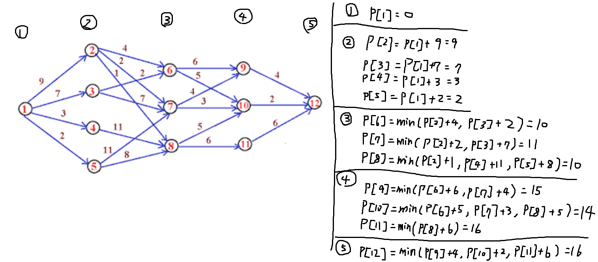
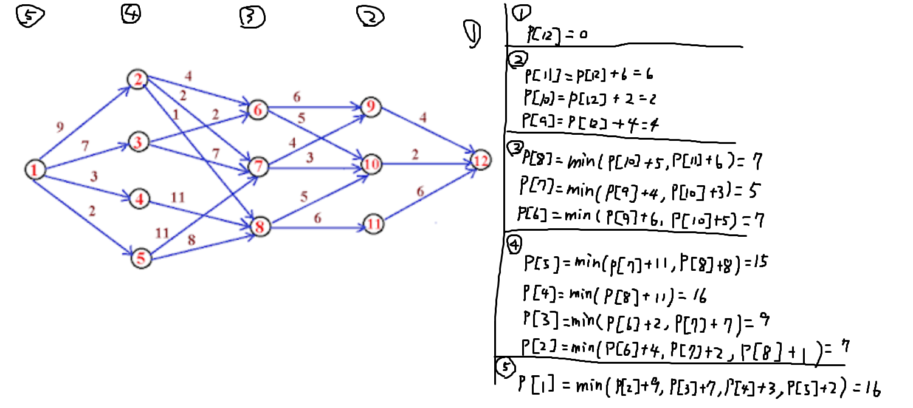
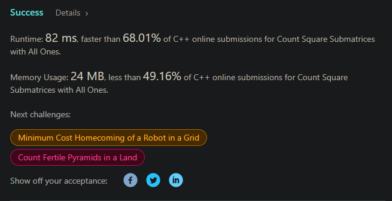
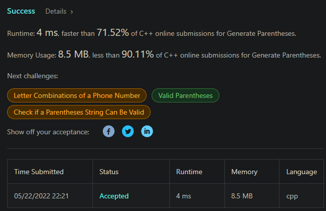
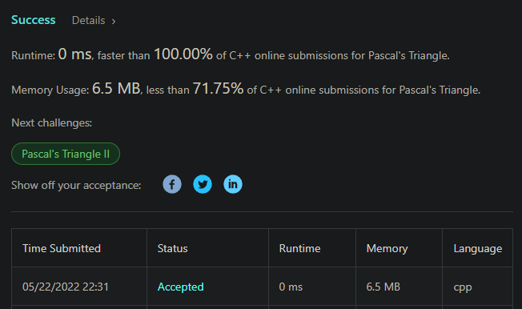

# 演算法作業 HW11

## 第1題: shortest path in multi-stage graph

> - 下圖為一個multi-stage graph，請分別以forward approach與backward approach，推導出其最短路徑。
> 

### forward


### backward


## 第2題: 計算正方形數量
> 完成程度: 完全靠自己，花費時間: ㄆㄆ 我又忘記記了


```c++
class Solution {
public:
    int countSquares(vector<vector<int>>& matrix) {
        int dp[matrix.size()][matrix[0].size()];
        memset(dp, 0, sizeof(dp));
        int ans = 0;
        for(int i = 0; i < matrix.size(); ++i) {
            for(int j = 0; j < matrix[i].size(); ++j) {
                dp[i][j] = (i == 0 || j == 0 || matrix[i][j] == 0) ? matrix[i][j] : min({dp[i-1][j], dp[i][j-1], dp[i-1][j-1]}) + 1;
                ans += dp[i][j];
            }
        }
        
        return ans;
    }
};
```

## 第3題: 所有可能的合法成對括號
> 完成程度: 完全靠自己，花費時間: ㄆㄆ 我又忘記記了



想了很久不知道怎麼去掉重複的情況，還是無腦用 set 好了，反正這個測資超弱。

```c++
class Solution {
public:
    vector<string> dp[9];
    
    void solve(int n) {
        if(dp[n].size() > 0) {
            return;
        } else if(n == 1) {
            dp[n] = {"()"};
            return;
        }
        
        set<string> st;
        
        for(int i = 1; i < n; ++i) {
            solve(i);
            solve(n-i);
            
            for(string& s1 : dp[i]) {
                for(string& s2 : dp[n-i]) {
                    st.insert(s1 + s2);
                }
            }
        }
        
        for(string& s : dp[n-1]) {
            st.insert("(" + s + ")");
        }
        
        for(auto& s : st) {
            dp[n].push_back(s);
        }
    }
    
    vector<string> generateParenthesis(int n) {
        solve(n);
        return dp[n];
        
    }
};

```

## 第4題: 巴士卡三角形
> 完成程度: 完全靠自己，花費時間: ㄆㄆ 我又忘記記了



```c++
class Solution {
public:
    vector<vector<int>> generate(int numRows) {
        if(numRows == 1) {
            return {{1}};
        }
        vector<vector<int>> ans;
        ans.resize(numRows);
        ans[0].push_back(1);
        ans[1].push_back(1);
        ans[1].push_back(1);
        for(int i = 1; i < numRows - 1; ++i) {
            ans[i+1].push_back(1);
            for(int j = 1; j < ans[i].size(); ++j) {
                ans[i+1].push_back(ans[i][j-1] + ans[i][j]);
            }
            ans[i+1].push_back(1);
        }
        return ans;
    }
};
```

## 第5題：心得

第一題的概念已經有點接近 floyd-warshall 演算法的概念了，O(n^3) 的任意點對最短路徑演算法，寫起來總共只要 5 行，本質上就是 dp。

就我目前寫 dp 題目的心得是，能觀察得出題目是 dp 不太難，難的是後面的狀態轉移式，而且目前寫到的 dp 頂多都 1 2 維的，之前看別人打 google code jam 的題目，有 3 維 dp，看都看不懂。

這學期最滿意的就是 10:30 上課，睡飽再上課真舒服。