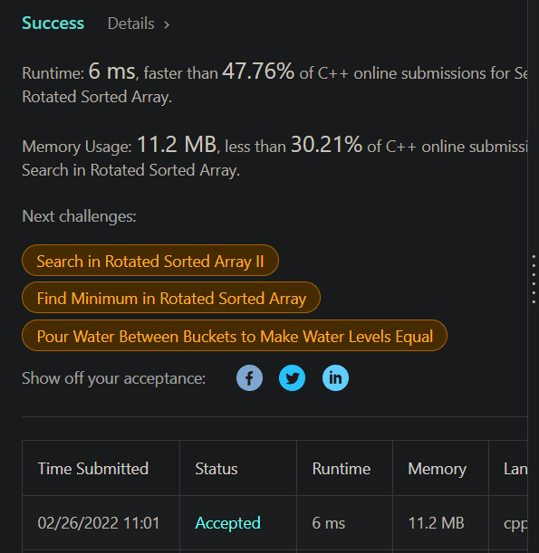

# 演算法作業 HW2

## 觀念題-1
> f(n) = 3n^3 - 5n + 6，求其時間複雜度 O()，並求最小的 c 和 n0?

令 c 為多項式最大項係數 + 1，c = 4
，g(n) 為多項式最大項，g(n) = n^3

f(n) = 3n^3 - 5n + 6 <= cg(n) = 4n^3

4n^3 >= 3n^3 - 5n + 6

n^3 +5n - 6 >= 0

(n-1)(n^2 + n + 6) >= 0

得 n0 = 1

當 c = 4、n0 = 1 時，會使得 f(n) <= cg(n), for every n >= n0

f(n) 為 O(n^3) 得證

## 觀念題-2

> f(n) = 2n^2 - 100n - 50，求其時間複雜度 O()，並求最小的 c 和 n0?

令 c 為多項式最大項係數 + 1，c = 3
，g(n) 為多項式最大項，g(n) = n^2

f(n) = 2n^2 - 100n - 50 <= cg(n) = 3n^2

3n^2 >= 2n^2 - 100n - 50

n^2 + 100n + 50 >= 0

n0 = 1

當正整數 c = 1、n0 = 1 時，會使得 f(n) <= cg(n), for every n >= n0

f(n) 為 O(n^2) 得證

## 第3題：數列被轉置

> 花費時間: 25分鐘，完成程度: 完全靠自己

[33. Search in Rotated Sorted Array - LeetCode](https://leetcode.com/problems/search-in-rotated-sorted-array/)

為了把時間壓在 log(n)，要用二分搜，最直覺的方法就是找中間交界點，然後分別對兩段區間做二分搜。

中間交界點我是找原本的 nums[0] 目前所在的位置，這樣剛好左閉右開的寫法可以直接用 built-in 函數。找交界點方法如下。

假如 `nums = [4,5,6,7,0,1,2]`，目標是要回傳第一個比 4 小的數字，那麼可以利用 `f(i) = nums[i] < nums[0]` 函數把問題映射成 `[0,0,0,1,1,1]` 找 1 的 lower_bound。

找出位置後分別對兩區間再找 target lower_bound 就好了。

```c++
class Solution {
public:
    
    // find k and do 2 bs 
    // worst case: O(2log(n/2) + log(n)) = O(log(n))
    int search(vector<int>& nums, int target) {
        int k;
        int l = 1;
        int r = nums.size();
        while(l < r) { // l closed, r open
            int mid = l + (r - l) / 2; // in case it overflows(although it wont cuz of the test cases)
            if(nums[mid] > nums[0]) {
                l = mid+1;
            } else {
                r = mid;
            }
        }
        k = l;
        // im lazy to do binary search again so i'll use built-in function
        auto l1 = nums.begin();
        auto l2 = nums.begin() + k;
        auto r1 = l2;
        auto r2 = nums.end();
        
        auto l_ans = lower_bound(l1, r1, target);
        auto r_ans = lower_bound(l2, r2, target);
        
        if(l_ans == r1 && r_ans == r2) {
            return -1;
        } else if(l_ans != r1 && *l_ans == target) {
            return l_ans - nums.begin();
        } else if(r_ans != r2 && *r_ans == target) {
            return r_ans - nums.begin();
        }
        
        return -1;
        
    }
};
```



## 第4題：數字可能重複，回傳範圍

> 花費時間: 5分鐘，完成程度: 完全靠自己

[34. Find First and Last Position of Element in Sorted Array](https://leetcode.com/problems/find-first-and-last-position-of-element-in-sorted-array/)

純粹找 lower_bound 和 upper_bound 而已。

```c++
class Solution {
public:
    vector<int> searchRange(vector<int>& nums, int target) {
        auto lb = lower_bound(nums.begin(), nums.end(), target);
        auto ub = upper_bound(nums.begin(), nums.end(), target);
        vector<int> ans;
        if(lb == ub) {
            ans = {-1, -1};
        } else {
            ans = {int(lb - nums.begin()), int(ub - nums.begin() - 1)};
        }
        return ans;
        
    }
};
```


## 第5題: 猜數字遊戲

> 花費時間: 10分鐘，完成程度: 完全靠自己

[374. Guess Number Higher or Lower](https://leetcode.com/problems/guess-number-higher-or-lower/)

就純粹二分搜，只是要寫成左閉右閉才行，不然左閉右開會 overflow，除非有個 guard clause。

```c++
/** 
 * Forward declaration of guess API.
 * @param  num   your guess
 * @return 	     -1 if num is lower than the guess number
 *			      1 if num is higher than the guess number
 *               otherwise return 0
 * int guess(int num);
 */

class Solution {
public:
    int guessNumber(int n) {
        int l = 1;
        int r = n;
        
        while(l < r) { // now I have to write l closed and r closed interval...
            int mid = l + (r - l) / 2; // in case it overflows
            int res = guess(mid);
            
            if(res == 0) {
                return mid;
            } else if(res == 1) {
                l = mid + 1;
            } else {
                r = mid - 1;
            }
        }
        
        return l;
    }
};
```


## 第6題 : 請寫下對於本週影片教學和程式作業的適應程度與喜惡。

不錯，目前都還挺入門的，big O 數學的定義和證明也有了。
