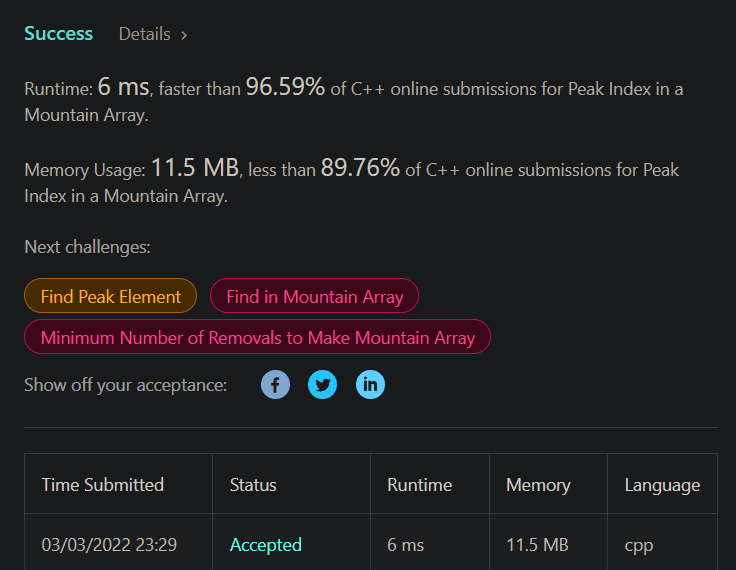

# 演算法作業 HW3

## 第1題: Insertion Sort

> 請依據課本推導方式，當 5 個數字用insertion sort排序，data movement的平均值為多少？

將一個數字 `a` 插入已排序的，長度為 `n-1` 的陣列， a 插入每個位置的機率為 `1/n`，則 movement 平均下來 `2/n + 3/n + 4/n + ... + (n+1)/n ` 會等於 `(n+3)/2`。（用等差數列和求得）

再來求 5 個數字的情況，，答案為 `13`。

> 請使用insertion sort排序 6,4,1,3,5。在四個回合中，每回合的data movement數量為何？總共的data movement數量為何？

1. `2 + 1 = 3` 
2. `2 + 2 = 4`
3. `2 + 2 = 4`
4. `2 + 1 = 3`

total : `3 + 4 + 4 + 3 = 14` 

## 第2題: Binary Search

> 請參考投影片25頁與26頁，算出15個有序數列使用Binary Search，平均的比對次數為何？

`[b,a1,b,a2,b,a3,b,a4,b,a5,b,a6,b,a7,b,a8,b,a9,b,a10,b,a11,b,a12,b,a13,b,a14,b,a15,b]`

若把 15 個元素當成 a1~a15，代表有搜尋到的位置，以及 16 個 b 當成沒搜尋到的位置，總共會有 31 種可能的位置(或叫區間)。所以查找得值落在這些區間的可能性皆為 `1/31`

先看 b 的部分，二分搜沒搜到的次數都是 `floor(log(n)) + 1`，所以 b 的部分總共次數為 `(n+1) * (floor(log(n)) + 1)`，`n` 以 `15` 帶入，得總次數為 `4 * 16 = 64`。

再看 a 的部分，若把次數畫成樹的樣子，可以發現是顆完全二元樹，已知完全二元樹第 `i` 層(1-based)
的節點數量為 `2^(i-1)`，且第 `i` 層代表需要 `i` 次才能找到，可得第 i 層的搜尋總次數加起來為 `i * 2^(i-1)`。由於 `n = 15`，總層數為 `log(15)+1 = 4`，又因是 perfect binary tree，所以次數總共為 `1*2^(1-1)` + `2*2^(2-1)` + `3*2^(3-1)` + `4*2^(4-1)` = `49`。

最後平均起來 `(49 + 64) / 31 = 3.645...` 次。

## 第3題：完全平方數

> 完成程度: 完全靠自己，花費時間: 沒有計算，三題加起來應該 40 分鐘內。

沒什麼好說的，就二分搜吧。
```c++
class Solution {
public:
    bool isPerfectSquare(int num) {
        int l = 1;
        int r = num;
        
        while(l < r) {
            int mid = l + ((r-l) >> 1);
            
            long long n = mid;
            n *= n;
            if(n == num) {
                return true;
            } else if(n > num) {
                r = mid - 1;
            } else {
                l = mid + 1;
            }
            
        }
        
        return (long long)l * l == num;
    }
};
```

## 第4題：尋找字元

> 完成程度: 完全靠自己，花費時間: 沒有計算，三題加起來應該 40 分鐘內。

求 upper_bound 而已。
```c++
class Solution {
public:
    char nextGreatestLetter(vector<char>& letters, char target) {
        int l = 0;
        int r = letters.size();
        while(l < r) {
            int mid = l + (r-l) / 2;
            if(letters[mid] <= target) {
                l = mid + 1;
            } else {
                r = mid;
            }
        }
        
        return l == letters.size() ? letters[0] : letters[l];
    }
};
```


## 第5題：尋找山頂

> 完成程度: 完全靠自己，花費時間: 沒有計算，三題加起來應該 40 分鐘內。

能二分搜代表有某種關係可以映射成有順序的樣子。
若把上升趨勢代表 0 下降趨勢代表 1，則可以把陣列弄成排序的樣子，接著找 1 的 lower_bound 就好。
```c++
class Solution {
public:
    int peakIndexInMountainArray(vector<int>& arr) {
        int l = 0;
        int r = arr.size();
        
        // return 0 if increasing, 1 decreasing
        auto mappingFunction = [&](int index) {
            if(index == arr.size() - 1) {
                return arr[index - 1] > arr[index];
            }
            return arr[index] > arr[index + 1];
        };
        while(l < r) {
            int mid = l + (r-l) / 2;
            if(mappingFunction(mid)) {
                r = mid;
            } else {
                l = mid + 1;
            }
        }
        
        return l;
    }
};

// 6 30 50 60 7 6 5 4 3 2 1
```
