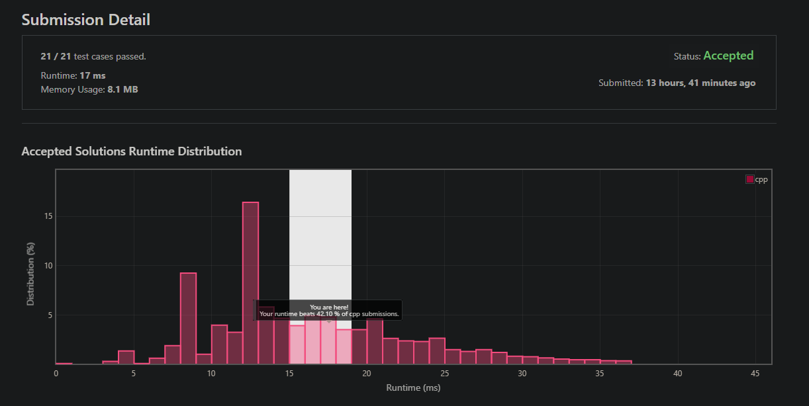

# 演算法作業 HW4

## 第1題: Selection Sort

> 請使用Selection sort排序，6,4,1,3,5。在四個回合中，每回合的Change of Flag數量為何？總共的Change of Flag數量為何？

不清楚是挑 max 還是挑 min，兩個都寫。

- MAX selection sort
        
        1. 0, [6, 4, 1, 3, 5] -> [5, 4, 1, 3, 6]
        2. 0, [5, 4, 1, 3, 6] -> [3, 4, 1, 5, 6]
        3. 1, [3, 4, 1, 5, 6] -> [3, 1, 4, 5, 6]
        4. 1, [3, 1, 4, 5, 6] -> [1, 3, 4, 5, 6]

        total = 2

- MIN selection sort

        1. 2, [6, 4, 1, 3, 5] -> [1, 4, 6, 3, 5]
        2. 1, [1, 4, 6, 3, 5] -> [1, 3, 6, 4, 5]
        3. 1, [1, 3, 6, 4, 5] -> [1, 3, 4, 6, 5]
        4. 1, [1, 3, 4, 6, 5] -> [1, 3, 4, 5, 6]

        total = 5


## 第2題: Quick Sort

> 使用Quick排序7個數字，1,2,3,4,5,6,7，請說明每回合的pivot如何選擇，會有best case。請參考投影片33頁，畫出二元樹表示。

由於序列是排好的，最理想他是一顆平衡樹最好，所以 pivot 挑中間會是最好的，複雜度估計約 `O(nlogn)`。


> 呈上題，請說明每回合的pivot如何選擇，會有worstcase。請參考投影片33頁，畫出二元樹表示。

由於序列是排好的，所以 pivot 挑最前面或最後面會是最差的，整棵樹會幾乎退化成 linked list，類似 bubble sort，複雜度 `O(n^2)`


## 第3題: 2-D Ranking Finding

> 平面上四個點，(1,1),(2,2),(3,3),(4,4)。請依照課本的方法，說明如何找出四個點的Ranking。(可配合畫圖表示)

這演算法看了一遍，本質就是 merge sort，跟求逆序對數量同一個模板的。

假設有兩組已排序的座標陣列，利用雙指標 l, r 分別指向兩個陣列的頭，接著一個一個迭代，如果 point[r] dominate point[l]，可以知道 point[r] 以後的都會 dominate point[l]。


## 第4題：回文Palindrome

> 花費時間: 10 分鐘，完成程度: 完全靠自己。

就一般的回文檢測，這題讓我想起了我之前看到一半的 Manacher 演算法(O(n)找最長回文子字串)，該找時間再來看完了。

isalnum 是我看了討論區才知道的 c 函式，原本是用 isalpha + isdigit。

```c++
class Solution {
public:
    bool isPalindrome(string s) {
        int l = 0;
        int r = s.length() - 1;
        
        while(l < r) {
            if(isalnum(s[l]) && isalnum(s[r])) {
                if(tolower(s[l]) != tolower(s[r])) {
                    return false;
                }
                l++;
                r--;
            } else {
                if(!isalnum(s[r])) {
                    r--;
                }
                if(!isalnum(s[l])) {
                    l++;
                }
            }
        }
        
        return true;
        
    }
};
```


## 第5題：Linked List是否存在Cycle

> 花費時間: 10 分鐘，完全程度: 完全靠自己。

linked list 題目經典到不能再經典的佛洛伊德迴圈檢測法，跟這個同等級經典的可能是 find merge point 跟 reverse a linked list 了吧。

大一剛入學在 HackerRank (另一個跟 leetcode 相似的 OJ) 寫過了。可以用 O(1) 空間 O(n) 時間的方式判斷有無迴圈。

```c++
/**
 * Definition for singly-linked list.
 * struct ListNode {
 *     int val;
 *     ListNode *next;
 *     ListNode(int x) : val(x), next(NULL) {}
 * };
 */
class Solution {
public:
    bool hasCycle(ListNode *head) {
        if(head == nullptr) {
            return false;
        }
        ListNode* r = head->next;
        ListNode* t = head->next;
        
        if(r != nullptr) {
            r = r->next;
        }
        
        while(r != nullptr && t != nullptr) {
            if(t == r) {
                return true;
            }
            
            t = t->next;
            r = r->next;
            if(r != nullptr) {
                r = r->next;
            }
            
        }
        
        return false;
        
    }
};
```



## 第6題 : 請寫下對於本週影片教學的疑問以及程式作業的適應情況。

O(log(n!)) = O(nlog(n)) 積分證明那邊跳得有點快，一下從黎曼和跳到 log e∫lnxdx，中間過程不知道怎麼來的。程式作業的部分很簡單，都是入門經典題。大部分時間都花在影片的部分。