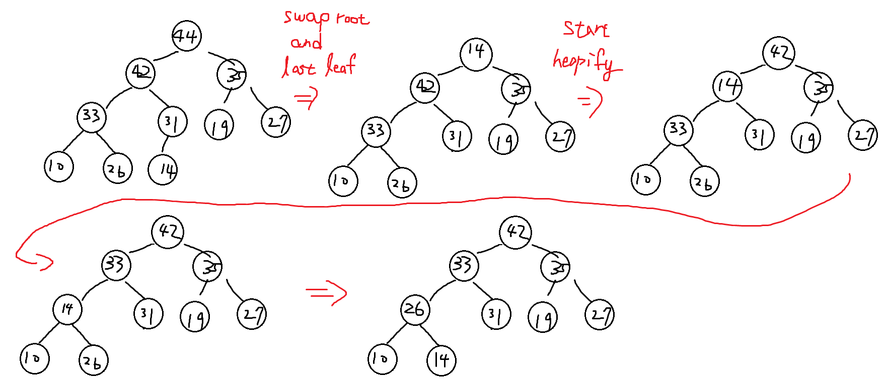
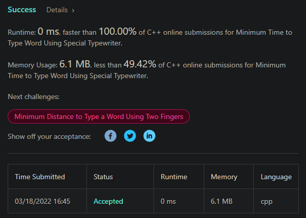
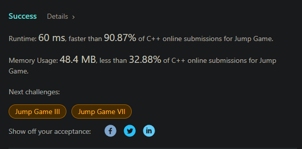

# 演算法作業 HW5

## 第1題: Heap Sort

> 1-1. 下圖為Max Heap。Heap Sort的每一回合，會將Heap的最大值刪除後，又恢復為Heap。請畫出第一回合恢復的過程。




> 1-2. 投影片69頁的公式如下，請解釋此公式的含意。

#### Ans: 在 worst case 的情況下，對第 L 層做向下更新所需要的比較次數。

#### Explain: 

`d` 是樹高，`d - L` 指的是第 `L` 層到葉節點的距離。在第 `L` 層總共有 `2^L` 個節點(以 0-base level 來說)，而最前面的 `2` 表示的是一個節點向下更新一次的比較次數，第一次比較兩子節點，第二次比較父節點和子節點。

而在 sigma 的 bound 為 `d-1` 的原因是因為只需要比較到最後一層個有葉子的父節點就可以了。

**build heap** 詳細內容可以在我的文章中的留言區看[ 高效排序法之二 - 堆積排序 (heap sort)](https://home.gamer.com.tw/artwork.php?sn=5062487)

## 第2題: Problem平均的Lower Bound

> 下圖為二元樹。參考投影片77頁，已知最高點(root)的深度為1，請算出二元樹的External Path Length，以及葉子平均深度。

`External path length`:  Root 到每個 Leaf 的 path 長度的加總

ans: 22

`葉子平均深度`: 22/6 = 3.666667

## 第3題: Problem Transformation


用凸包演算法跑過的 output: `[(1,1), (2,4), (3,9), (4,16), (5,25)]`

## 第4題：圓型打字機
> 花費時間: 10分鐘，完成程度: 完全靠自己

求環上距離問題

```c++
class Solution {
public:
    int minTimeToType(string word) {
        auto distance = [&](const char& a, const char& b) {
            return min(abs(int(a)-int(b)), 'z' - max(a, b) + min(a, b) - 'a' + 1);
        };
        
        int ans = 0;
        char prev = 'a';
        for(int i = 0; i < word.size(); ++i) {
            ans += distance(word[i], prev);
            prev = word[i];
        }
        
        return ans + word.size();
    }
};
```



## 第5題：跳到最後

> 花費時間: 不知道，前幾天剛好寫過，完成程度: 完全靠自己

原本開一個 array 來做暴力塗色，後來 tle 後用 pointer 判斷加速，接著又想到 array 也沒有存在的必要，一直優化就變這樣了

```c++
class Solution {
public:
    bool canJump(vector<int>& nums) {
        int n = nums.size();
        int trueIndex = 0;
        for(int i = 0; i < n; ++i) {
            if(i <= trueIndex) {
                trueIndex = max(trueIndex, i + nums[i]);
            } else {
                break;
            }
        }
        
        return trueIndex >= n - 1;
    }
};
```



## 心得

凸包演算法沒有詳細說是什麼，覺得有點不知道轉的意義在哪裡。
