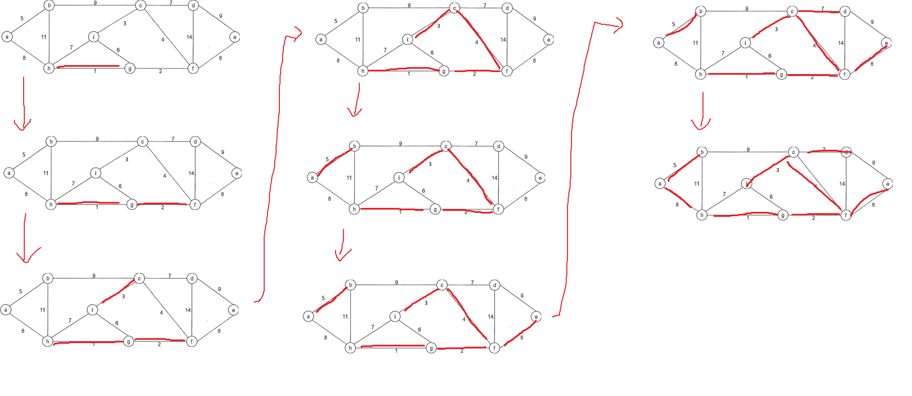

# 演算法作業 HW6

## 第1題: Minimum Spanning Tree

> 1-1 請以Kruskal方法，找出下圖的最小生成樹。請依序列出所選擇加入的邊。

排序所有邊，然後一個一個 pop 出來，再檢查有無迴路，有迴路就跳過。

迴路檢查實作用並查集(disjoint set)來檢查。



> 1-2 同上題，請改為使用Prim(從a開始)方法。

改成跟 dijkstra 差不多的方式，用 priority queue 記邊，然後檢查有沒有迴路。

迴路檢查實作用並查集(disjoint set)來檢查。


## 第2題: Single Source Shortest Path

> 請用Dijkstra演算法找出下圖的由A出發的shortest path tree，並完成右表(共五回合)。

把 bfs 用的 queue 改成 priority queue 就好，每次 greedy 挑最小的邊。


## 第3題: Huffman Code

> 已知一份文件內7個符號出現的頻率為：A:2, B:8: C:3, D:4, E:6, F:10, G:7。請找出此7個符號的Huffman code。

### 黑色是我一開始寫的，但是第二題會解不出來


> 若有一組編碼為1100110111，求解碼後的符號。

我覺得怪怪的，huffman 應該有多種樣子

FDEF

## 第4題：隔出最多的水
> 花費時間: 10分鐘，完成程度: 完全靠自己

經典雙指標面試題

```c++
class Solution {
public:
    int maxArea(vector<int>& height) {
        int l = 0;
        int r = height.size()-1;
        
        int ans = 0;
        
        while(l < r) {
            ans = max(ans, (r-l) * min(height[l], height[r]));
            if(height[l] < height[r]) {
                l++;
            } else {
                r--;
            }
        }
        return ans;
    }
};
```

## 第5題：跳到最後-V2
> 花費時間: 不知道，以前寫過的，完成程度: 完全靠自己
```c++
class Solution {
public:
    int jump(vector<int>& nums) {
        if(nums.size() == 1) {
            return 0;
        }
        int n = nums.size();
        int dp[n];
        memset(dp, 0x3f, sizeof(dp));
        dp[0] = 0;
        for(int i = 0; i < n; ++i) {
            for(int j = nums[i]; j >= 1; --j) {
                if(i + j < nums.size() - 1) {
                    dp[i+j] = min(dp[i+j], dp[i] + 1);
                } else {
                    return dp[i]+1;
                }
            }
        }
        
        return dp[n-1];
    }
};
```


## 心得

這次作業好像都可以吃老本。霍夫曼編碼我覺得題目怪怪的，理論上霍夫曼編碼應該是有很多種可能的，根據演算法內部的實作細節，像我一開始建的第二題就解不出來，我也算過 external path 也都是一樣小。