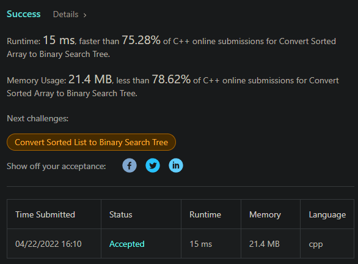

# 演算法作業 HW7

## 第1題: knapsack problem背包問題(Ch3)

> 有四件物品，編號由1到4，物品重量依序為20,40,10,30。物品價值依序為100,60,30,60。背包最大限重為80。請說明要放哪些東西(可以放部分)，可以讓背包內物品價值總合最大。

Ans: 編號134，價值 190 (如果是 01 背包問題的話)

## 第2題: Closest Pair Problem

> 請說明Closest Pair Problem，每回合的合併過程？(可參考PPT13頁)

1. 先確保左右兩邊都是 y 升序排列
2. 取左右邊區間答案的最小值 d
3. 對於左區間每個點，檢查當前點的 x-d ~ x+d 和 y-d ~ y+d，若找到點則更新當前的 d，利用已經排序好的特性來向上搜，可以確保為 O(n)

## 第3題: Convex Hull Problem

> 請說明Convex Hull Problem，
(1)為何不直接用sort來得到polygon，而要採用merge？

Ans: 直接用 sort 會比原本暴力法的複雜度還高，因為 sort 本身就有 nlogn 的限制，而 merge 可以利用已經有的條件達成 O(n) 有序。

> (2)請說明如何將polygon，修改成convex hull？


利用 Graham 掃描法，從最下最左的點開始，逆時針開始找，若掃到點的轉向變成順時針，向前追溯走過的點，並把造成反角的點移除，做到結束為止。

## 第4題: 將linked list的數列排序
> 完成程度: getMiddleNode的O(1)空間法查了一下，其它自己寫，花費時間: 兩小時

沒刻過 linked list 版的 merge sort，被指標坑了很久。

```c++
/**
 * Definition for singly-linked list.
 * struct ListNode {
 *     int val;
 *     ListNode *next;
 *     ListNode() : val(0), next(nullptr) {}
 *     ListNode(int x) : val(x), next(nullptr) {}
 *     ListNode(int x, ListNode *next) : val(x), next(next) {}
 * };
 */
class Solution {
public:
    ListNode* en = nullptr;
        
    ListNode* getMiddleNode(ListNode* head, ListNode* end) {
        ListNode* rabbit = head;
        ListNode* turtle = head;
        while(rabbit != end && rabbit->next != end) {
            rabbit = rabbit->next->next;
            turtle = turtle->next;
        }
        return turtle;
    }
    
    ListNode* mergeSort(ListNode* head, ListNode* end) {
        if(head == end) {
            en = head;
            return head;
        } else if(head->next == end) {
            en = head;
            return head;
        }
        ListNode* middle = getMiddleNode(head, end);
        ListNode* li = mergeSort(head, middle);
        ListNode* tmp = en;
        ListNode* ri = mergeSort(middle, end);
        tmp->next = ri;
        middle = ri;
        
        ListNode* sorted = nullptr;
        while(li != middle || ri != end) {
            if(sorted == nullptr) {
                if(li == middle) {
                    sorted = ri;
                    ri = ri->next;
                } else if(ri == end) {
                    sorted = li;
                    li = li->next;
                } else if(li->val > ri->val) {
                    sorted = ri;
                    ri = ri->next;
                } else {
                    sorted = li;
                    li = li->next;
                }
                head = sorted;
            } else if(li == middle || (ri != end && ri->val < li->val)) {
                sorted->next = ri;
                ri = ri->next;
                sorted = sorted->next;
            } else {
                sorted->next = li;
                li = li->next;
                sorted = sorted->next;
            }
        }
        if(sorted) {
            sorted->next = end;
        }
        en = sorted;
        return head;
    }
    
    ListNode* sortList(ListNode* head) {
        return mergeSort(head, nullptr);
    }
};
```


## 第5題: 將排序好的數列轉為二元搜尋樹
> 完成程度: 完全靠自己，花費時間: 25分鐘

以為只要轉成 BST 就好，所以浪費了 10 分鐘，不然一開始沒看錯看題目應該可以壓到 10 分鐘寫完。好險是 sorted array，不然想到要補 AVL tree 的坑就累。

```c++
/**
 * Definition for a binary tree node.
 * struct TreeNode {
 *     int val;
 *     TreeNode *left;
 *     TreeNode *right;
 *     TreeNode() : val(0), left(nullptr), right(nullptr) {}
 *     TreeNode(int x) : val(x), left(nullptr), right(nullptr) {}
 *     TreeNode(int x, TreeNode *left, TreeNode *right) : val(x), left(left), right(right) {}
 * };
 */
class Solution {
public:
    
    // let's go with left close and right open
    TreeNode* solve(vector<int>& nums, int l, int r) {
        if(l == r) {
            return nullptr;
        } else if(r - l == 1) {
            return new TreeNode(nums[l]);
        }
        int middle = (r + l) / 2;
        TreeNode* root = new TreeNode(nums[middle]);
        TreeNode* ln = solve(nums, l, middle);
        TreeNode* rn = solve(nums, middle + 1, r);
        
        root->left = ln;
        root->right = rn;
        return root;
        
    }
    
    TreeNode* sortedArrayToBST(vector<int>& nums) {
        return solve(nums, 0, nums.size());
    }
};
```




## 第6題：心得

在 convex hull 那邊有點不是很懂，為何不直接找最低點，對點做排序預處理然後用 Graham scan 找凸包就好，也是 nlogn 等級的，而且實作上更直覺容易，感覺分治法有點多餘？有點像是把 Graham scan 壓進去 merge sort 的概念。 

## 挑戰題(自由作答): 美麗數列
> 完成程度: 參考解法方向，花費時間: 1~2天

Divide and conquer 和 dp 選一個，還是選熟悉的 dp。

先用 buttom up 法推出前幾個答案，再用 top down 來實作。不過不知道原理是什麼，靠觀察規律寫出來的。

感覺這題應該難度是偏 hard 的。

```c++
// [1] => 1
// [1, 2] => 1 | 1
// [1, 3, 2] => 1 2 | 1
// [1, 3, 2, 4] => 1 2 | 1 2
// [1, 5, 3, 2, 4] => 1 3 2 | 1 2
// [1, 5, 3, 2, 6, 4] => 1 3 2 | 1 3 2
// [1, 5, 3, 7, 2, 6, 4] => 1 3 2 4 | 1 3 2
// [1, 5, 3, 7, 2, 6, 4, 8] => 1 3 2 4 | 1 3 2 4
class Solution {
public:
    
    vector<int> dp[1001];
    
    bool isCalculated(int n) {
        return dp[n].size() != 0;
    }
    
    // top down dp
    void solve(int n) { // pure guessing :)
        if(n == 1) {
            if(!isCalculated(1)) {
                dp[n] = {1};
            }
            return;
        } else if(isCalculated(n)) {
            return;
        }
        
        solve(n / 2);
        if(n & 1) { // if n is odd
            solve(n / 2 + 1);
            for(int num : dp[n/2 + 1]) {
                dp[n].push_back(num * 2 - 1);
            }
            
            for(int num : dp[n/2]) {
                dp[n].push_back(num * 2);
            }
            
        } else { // if n is even
            for(int num : dp[n/2]) {
                dp[n].push_back(num * 2 - 1);
            }
            
            for(int num : dp[n/2]) {
                dp[n].push_back(num * 2);
            }
        }
        
    }
    
    vector<int> beautifulArray(int n) { 
        solve(n);
        return dp[n];
    }
};
```

