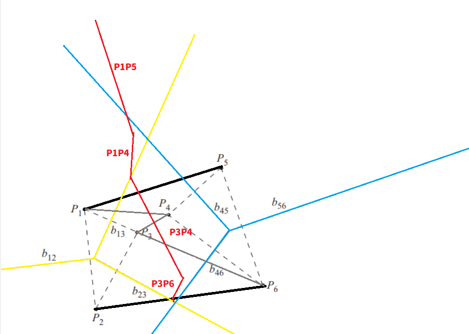

# 演算法作業 HW8

## 第1題: Voronoi Diagram

> 請畫出下圖兩個VD合併結果，畫出新建立的線段(註明為哪兩點的中垂線)，並說明簡述流程。


**由於中垂線是目測的，所以最後面有些誤差，不確定是否是對的，所以沒有畫**

黃色是左邊 VD，藍色是右邊 VD



## 第2題: Voronoi Diagram的應用

> 請說明 The Euclidean all nearest neighbor problem 為何，以及如何應用VD來解此問題？

*The Euclidean all nearest neighbor problem* 就是找每個點與之最短距離的點。

利用 VD 圖可以知道最近點一定是與其有中垂線的其中一個點。

## 第3題: FFT

> 當輸入為：{1,2,3,4,5,6,7,8,9,10,11,12,13,14,15,16}，請說明如何應用FFT得到結果(只須說明計算過程，不用算出結果)？

    => [1, 3, 5, 7, 9, 11, 13, 15]

        => [1, 5, 9, 13]
            => [1, 9]
            => [5, 13]
            # merge

        => [3, 7, 11, 15]
            => [3, 11]
            => [7, 15]
            # merge
        # merge

    => [2, 4, 6, 8, 10, 12, 14, 16]

        => [2, 6, 10, 14]
            => [2, 10]
            => [6, 14]
            # merge

        => [4, 8, 12, 16]
            => [4, 12]
            => [8, 16]
            # merge
        # merge
    # merge

## 第4題: 由Preorder與Inorder建構二元樹
> 完成程度: 完全靠自己，花費時間: 忘記了

是可以用傳 index 遞迴的方式來優化，不過懶得用了，反正演算法大概就這樣。

```c++
/**
 * Definition for a binary tree node.
 * struct TreeNode {
 *     int val;
 *     TreeNode *left;
 *     TreeNode *right;
 *     TreeNode() : val(0), left(nullptr), right(nullptr) {}
 *     TreeNode(int x) : val(x), left(nullptr), right(nullptr) {}
 *     TreeNode(int x, TreeNode *left, TreeNode *right) : val(x), left(left), right(right) {}
 * };
 */
class Solution {
public:
    TreeNode* buildTree(vector<int>& preorder, vector<int>& inorder) {
        if(preorder.size() == 0) {
            return nullptr;
        }
        int mid = preorder[0];
        TreeNode* root = new TreeNode(mid);
        int k = 0;
        for(int i = 0; i < inorder.size(); ++i) {
            if(inorder[i] == mid) {
                k = i;
                break;
            }
        }
        
        vector<int> lp = vector<int>(preorder.begin() + 1, preorder.begin() + 1 + k);
        vector<int> li = vector<int>(inorder.begin(), inorder.begin() + k);
        root->left = buildTree(lp, li);
        vector<int> rp = vector<int>(preorder.begin() + k + 1, preorder.end());
        vector<int> ri = vector<int>(inorder.begin() + 1 + k, inorder.end());
        root->right = buildTree(rp, ri);
        
        return root;
        
    }
};
```


## 第5題: 由Postorder與Inorder建構二元樹
> 完成程度: 完全靠自己，花費時間: 忘記了

```c++
/**
 * Definition for a binary tree node.
 * struct TreeNode {
 *     int val;
 *     TreeNode *left;
 *     TreeNode *right;
 *     TreeNode() : val(0), left(nullptr), right(nullptr) {}
 *     TreeNode(int x) : val(x), left(nullptr), right(nullptr) {}
 *     TreeNode(int x, TreeNode *left, TreeNode *right) : val(x), left(left), right(right) {}
 * };
 */
class Solution {
public:
    TreeNode* buildTree(vector<int>& inorder, vector<int>& postorder) {
        if(inorder.size() == 0) {
            return nullptr;
        }
        int mid = postorder.back();
        TreeNode* root = new TreeNode(mid);
        int k = 0;
        for(int i = 0; i < inorder.size(); ++i) {
            if(inorder[i] == mid) {
                k = i;
                break;
            }
        }
        
        vector<int> li = vector<int>(inorder.begin(), inorder.begin() + k);
        vector<int> lp = vector<int>(postorder.begin(), postorder.begin() + k);
        root->left = buildTree(li, lp);
        vector<int> ri = vector<int>(inorder.begin() + k + 1, inorder.end());
        vector<int> rp = vector<int>(postorder.begin() + k, postorder.end() - 1);
        root->right = buildTree(ri, rp);
        return root;
        
    }
};
```


## 第6題：心得

為什麼快樂的演算法要鬼轉成傅立葉轉換 :(