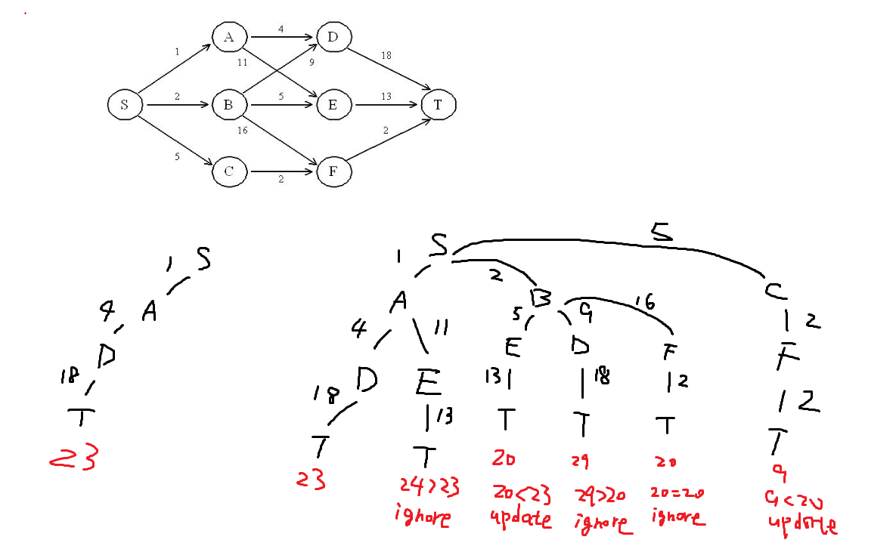
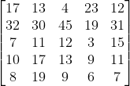
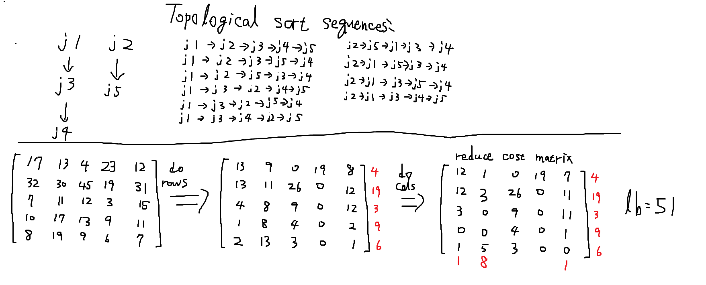
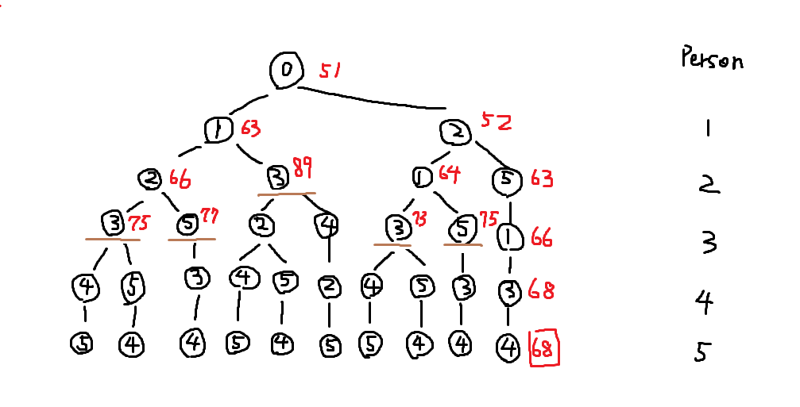
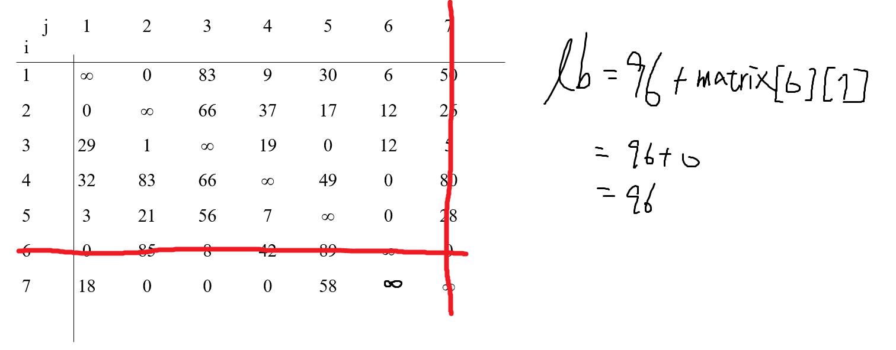
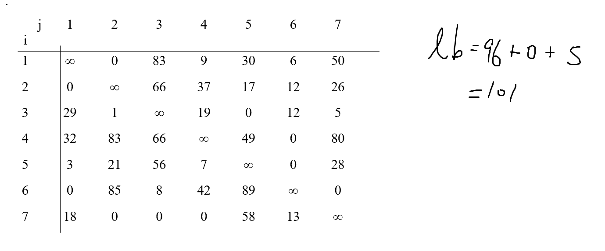
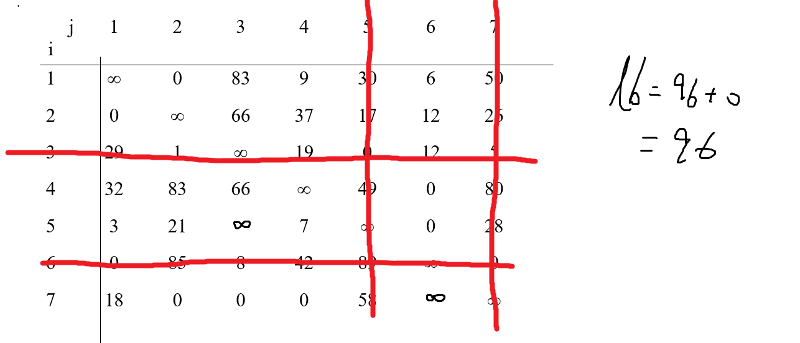
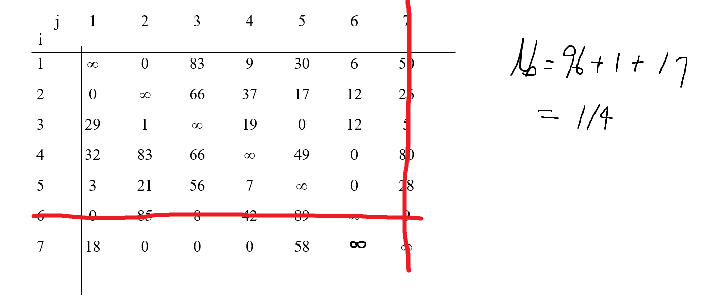
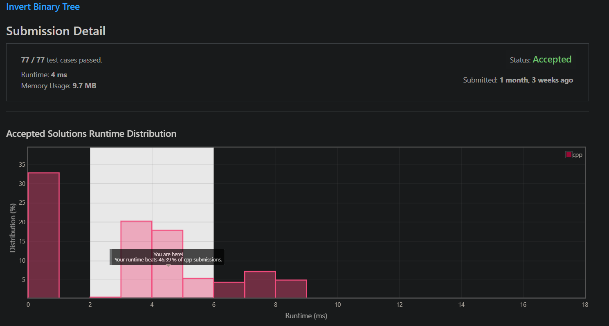
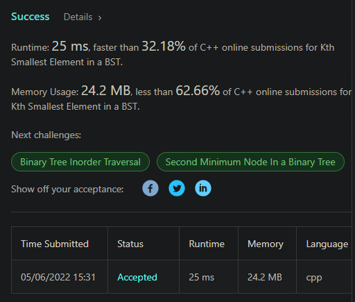

# 演算法作業 HW9

## 第1題: 最短路徑

> 請使用Branch-and-Bound找出下圖中，S到T的最短路徑。請畫出Branch-and-Bound圖，並標示各點的cost，以及被bound住的地方。(可參考ppt20頁)
> 



## 第2題: Personnel Assignment Problem

> - 已知5個工作(j1,…,j5)，其先後關係為：j1 < j3 , j3 < j4 , j2 < j5，分配給5個人員(p1,…,p5)
> - 其cost matrix如下：
> 
> - 例如：p1作j1到j5的工資分別為17,13,4,23,12
> - 每人分配一個工作，且當ja < jb ，須要 pa < pb。
> - 請使用Branch-and-Bound找出最少費用的人員工作分配。




## 第3題: Traveling Salesperson Optimization Problem

> - 在ppt34頁中，該例首先以4-6將所有feasible solution分為兩集合。
> - 現在，將原例的4-6改以6-7來作區分，接著再以3-5作區分，如下圖所示：
> 

**原始 reduced cost matrix**


**With arc 6-7**


**Without arc 6-7**


**With arc 3-5**


**Without arc 3-5**



## 第4題: 左右反轉二元樹

> 完成程度: 完全靠自己，花費時間: 不知道，以前做過了
```c++
/**
 * Definition for a binary tree node.
 * struct TreeNode {
 *     int val;
 *     TreeNode *left;
 *     TreeNode *right;
 *     TreeNode() : val(0), left(nullptr), right(nullptr) {}
 *     TreeNode(int x) : val(x), left(nullptr), right(nullptr) {}
 *     TreeNode(int x, TreeNode *left, TreeNode *right) : val(x), left(left), right(right) {}
 * };
 */
class Solution {
public:
    TreeNode* invertTree(TreeNode* root) {
        if(root == nullptr) {
            return nullptr;
        }
        swap(root->left, root->right);
        invertTree(root->left);
        invertTree(root->right);
        return root;
    }
};
```



## 延伸練習題:
> 完成程度: 完全靠自己，花費時間: 10分鐘

中序暴搜就行。

```c++
/**
 * Definition for a binary tree node.
 * struct TreeNode {
 *     int val;
 *     TreeNode *left;
 *     TreeNode *right;
 *     TreeNode() : val(0), left(nullptr), right(nullptr) {}
 *     TreeNode(int x) : val(x), left(nullptr), right(nullptr) {}
 *     TreeNode(int x, TreeNode *left, TreeNode *right) : val(x), left(left), right(right) {}
 * };
 */
class Solution {
public:
    int cnt;
    int ans = -1;
    void infix(TreeNode* node) {
        if(node == nullptr || ans != -1) {
            return;
        }
        infix(node->left);
        cnt--;
        if(ans == -1 && cnt == 0) {
            ans = node->val;
            return;
        }
        infix(node->right);
    }
    int kthSmallest(TreeNode* root, int k) {
        cnt = k;
        infix(root);
        return ans;
    }
};
```



## 第5題：心得

Branch-and-Bound 其實就是一種剪枝法，跟 alpha-beta pruning 差不多類型的策略，都是為了優化暴搜的演算法。

還有在 Hill climbing 的影片中，有提到 best-first search，我個人覺得存 node 的資料結構不應該是 list，用 heap 會是更好的選擇(或者說是 priority queue)，畢竟每次關注的點都是極值，利用 heap 插入和移除都只要 log(n)，相比每次排序 nlog(n) 好非常的多，這個方法在實作 dijkstra 非常常用到。
